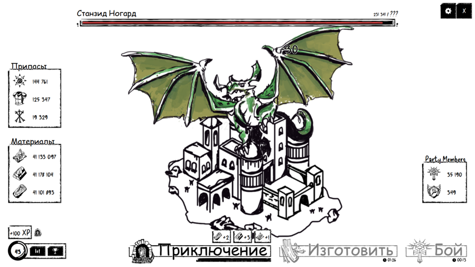

# Бот для Discord-игры

<div align="center">
    
    
    
    <br>
    <a href="README.md"></a>
</div>

## Обзор

<p align="center">
  
</p>

Скрипт автоматизации для Discord-активностей с поддержкой:
1. Повторяющихся кликов
2. Игры 3x3 с подбором троек
3. Игры с последовательностями стрелок

Скрипт запускается напрямую через Console в DevTools Discord.

## Возможности

- Автоматические действия в поддерживаемых игровых активностях
- Циклическое прохождение с учетом кулдаунов и перезапуска
- Обработка кнопки Continue после завершения раундов
- Управление во время работы (start, stop, status, unload)
- Алиасы команд для удобства

## Файл скрипта

Используйте файл:
- [script.js](script.js)

## Как включить DevTools в Discord Desktop

Используйте WIN+R, чтобы открыть окно Выполнить, и перейдите в папку настроек нужной версии Discord:

1. Discord: `%APPDATA%\Discord\`
2. Discord PTB (Public Test Build): `%APPDATA%\DiscordPTB\`
3. Discord Canary: `%APPDATA%\discordcanary\`

Дальше:

1. Откройте файл `settings.json`.
2. Рекомендуется включить отображение расширений файлов в Windows.
3. Лучше редактировать файл в нормальном текстовом редакторе (например, Notepad++).
4. Добавьте запись:

```json
"DANGEROUS_ENABLE_DEVTOOLS_ONLY_ENABLE_IF_YOU_KNOW_WHAT_YOURE_DOING": true
```

Пример до:

```json
{
    "BACKGROUND_COLOR": "#202225",
    "IS_MAXIMIZED": false,
    "IS_MINIMIZED": false,
    "WINDOW_BOUNDS": {
        "x": 288,
        "y": 51,
        "width": 1591,
        "height": 919
    },
    "OPEN_ON_STARTUP": false
}
```

Пример после:

```json
{
    "BACKGROUND_COLOR": "#202225",
    "IS_MAXIMIZED": false,
    "IS_MINIMIZED": false,
    "WINDOW_BOUNDS": {
        "x": 288,
        "y": 51,
        "width": 1591,
        "height": 919
    },
    "OPEN_ON_STARTUP": false,
    "DANGEROUS_ENABLE_DEVTOOLS_ONLY_ENABLE_IF_YOU_KNOW_WHAT_YOURE_DOING": true
}
```

Важно: после строки `"OPEN_ON_STARTUP": false` обязательно нужна запятая перед добавлением нового ключа.

## Как использовать

1. Откройте Discord и зайдите в нужную игру.
2. Откройте DevTools и вкладку Console.
3. Скопируйте содержимое [script.js](script.js).
4. Вставьте в Console и нажмите Enter.
5. Все модули стартуют автоматически.

## Команды

### Общие

- window.discordGameBots.startAll()
- window.discordGameBots.stopAll()
- window.discordGameBots.status()
- window.discordGameBots.unload()

### По модулям

- window.discordGameBots.adventure.start()
- window.discordGameBots.triplet.start()
- window.discordGameBots.arrow.start()

### Алиасы для совместимости

- window.adventureClicker
- window.tripletGridBot
- window.arrowSequenceBot

## Отказ от ответственности

Скрипт предназначен только для образовательных целей. Используйте на свой риск. Автоматизация может нарушать условия использования Discord.

## 📬 Контакты

По вопросам или предложениям обращайтесь в Telegram: [@mudachyo](https://t.me/mudachyo)

## Лицензия

Проект распространяется под лицензией MIT. Подробности: [LICENSE](LICENSE).
